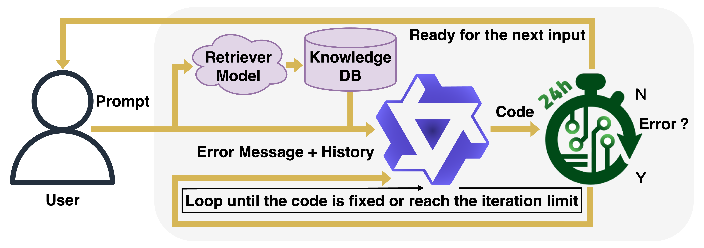

# OpenROAD Agent
This repository contains scripts that enable large-language models (LLMs) to serve as agents for interacting with [OpenROAD](https://github.com/The-OpenROAD-Project/OpenROAD) and reproducing the results in the paper.

## Framework Description

Large language models (LLMs) are increasingly being used in various domains, including chip design. Recent works have demonstrated the effectiveness of LLMs in EDA tool script generation. However, these LLMs can often hallucinate API calls even when directly provided API documentation and context. As a result, this leads to significant errors and inefficiencies in chip design workflows. To address this, we introduce OpenROAD Agent, an LLM that integrates directly with OpenROAD, an open-source tool for physical design. OpenROAD Agent enables real-time script generation with error detection and correction. OpenROAD Agent autonomously generates and executes Python code within OpenROAD while dynamically refining outputs based on tool feedback. OpenROAD Agent leverages [Qwen2.5-Coder](https://github.com/QwenLM/Qwen2.5-Coder) and employs a hybrid supervised and reinforcement learning training to improve code correction capabilities, usability, and hallucination frequency. OpenROAD Agent achieves an accuracy of 94% on script generation tasks and outperforms both prior work and existing foundation models.

## Model Weights
Model weights can be found on [Google Drive](https://drive.google.com/drive/folders/1K8IqgZuiulumGWP7Qsa-GyYNV6zZU1B-?usp=sharing). After downloading, please place the two folders in [src/Saved_Model](./src/Saved_Model/).

## Table of Content
  - [design](./design): Sample gcd design and [nangate45 library](./design/nangate45) from [OpenROAD-flow-scripts](https://github.com/The-OpenROAD-Project/OpenROAD-flow-scripts/tree/master) for running the training and testing scripts in [src](./src).
  - [EDA-Corpus-v2](./EDA-Corpus-v2): An augmented version of the [EDA-Corpus dataset](https://ieeexplore.ieee.org/document/10691774) used in this paper.
  - [OpenROAD_update](./OpenROAD_update/): Contains files to Pythonize the macro placer in [OpenROAD](./OpenROAD)
  - [RAGData](./RAGData/): Contains files for building the retrieval-augmented generation (RAG) database used in training and testing.
  - [result](./result/): Default directory for storing test results generated using scripts in [./src](./src).
  - [src](./src/): Contains scripts for reproducing LLM training results and running tests.
  - [requirement.txt](./requirement.txt): Contains packages for building the training and testing environment.

## Build OpenROAD and Pythonize the Macro Placer

The following technique assumes you have a machine with the required Ubuntu OS prerequisite of OpenROAD.

Install dependencies for OpenROAD:
```
sudo ./OpenROAD/etc/DependencyInstaller.sh
```

Once dependencies have been installed, build OpenROAD and Pythonize the macro placer:

```
cd ./OpenROAD_update
bash replace.sh
cd ../OpenROAD/
mkdir build
cd build
cmake ..
make -j
```

## Training and Testing:
Please see [src](./src/).
