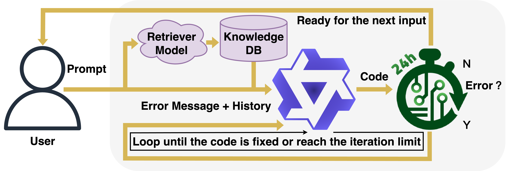

# OpenROAD Agent
This repository contains scripts that enable large-language models (LLMs) to serve as agents for interacting with [OpenROAD](https://github.com/The-OpenROAD-Project/OpenROAD) and reproducing the results in the paper.

## Framework Description

Large language models (LLMs) are increasingly being used in various domains, including chip design. Recent works have demonstrated the effectiveness of LLMs in providing both natural language responses and script generation for chip design. Despite these successes, LLM-generated scripts often produce hallucinated API calls as existing models operate in isolation from design tools, lacking real-time integration and automated feedback loops for code correction. As a result, this leads to significant errors and inefficiencies in practical chip design workflows. To address this, we introduce OpenROAD Agent, an LLM that integrates directly with OpenROAD, an open-source tool for physical design. OpenROAD Agent enables real-time script generation with error detection and correction. OpenROAD Agent autonomously generates and executes Python code within OpenROAD while dynamically refining outputs based on tool feedback. OpenROAD Agent leverages Qwen2.5-Coder and employs a hybrid supervised and reinforcement learning training to improve code correction capabilities and usability and reduce hallucinations. This approach leverages the proven policy optimization to train the model to learn from its mistakes. The assistant receives reward-based feedback for successful operations and penalties for errors for iterative code correction. Notably, OpenROAD Agent outperforms prior work, existing foundation models, and proposed baselines in terms of script generation accuracy.

## Table of Content
  - [Design](./Design): Sample gcd design and [nangate45 library](./Design/nangate45) from [OpenROAD-flow-scripts](https://github.com/The-OpenROAD-Project/OpenROAD-flow-scripts/tree/master) for running the training and testing scripts in [src](./src).
  - [EDA-Corpus-v2](./EDA-Corpus-v2): An augmented version of the [EDA-Corpus dataset](https://ieeexplore.ieee.org/document/10691774) used in this paper.
  - [OpenROAD_update](./OpenROAD_update/): Contains files to Pythonize the macro placer in [OpenROAD](./OpenROAD)
  - [RAGData](./RAGData/): Contains files for building the retrieval-augmented generation (RAG) database used in training and testing.
  - [Result](./Result/): Default directory for storing test results generated using scripts in [./src](./src).
  - [src](./src/): Contains scripts for reproducing LLM training results and running tests.

## Build OpenROAD and Pythonize the Macro Placer

The following technique assumes you have a machine with the required Ubuntu OS prerequisite of OpenROAD

Install dependencies for OpenROAD:
```
sudo ./OpenROAD/etc/DependencyInstaller.sh
```

Once dependencies have been installed, build OpenROAD and Pythonize the macro placer:

```
cd ./OpenROAD_update
bash replace.sh
cd ../OpenROAD/
mkdir build
cd build
cmake ..
make -j
```

## Training and Testing:
Please see [src](./src/).
