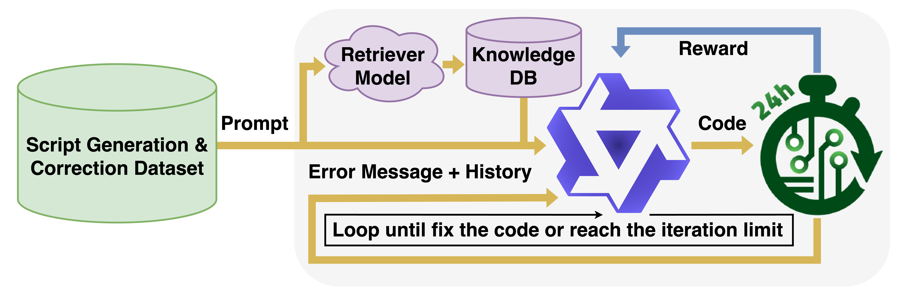

# src
This directory contains training and testing scripts for reproducing the results in the paper.

The dataset shuffling variable is hardcoded in each training script to ensure the reproduced results match the ones in the paper.

The [*./Saved_Model*](./Saved_Model) directory serves as the default path for storing the trained OpenROAD-Agents and the retrained OpenROAD-Assistant.

## Training

### 1st Stage Training

[*train1stStage.py*](./train1stStage.py) is the script used to launch the 1st-stage training scheme described in the paper. The parameters used in the paper are provided as the default values for the flags. Simply run the following command to start the training process. The trained LoRA adapter will be saved in the [*./Saved_Model*](./Saved_Model) directory.
- "***--dbTrainSetPath***": Path to the database-based (DB-based) data points. The default path is [*../EDA-Corpus-v2/DB-v2.xlsx*](../EDA-Corpus-v2/DB-v2.xlsx).
- "***--flowTrainSetPath***": Path to the flow-based data points. The default path is [*../EDA-Corpus-v2/Flow-v2.xlsx*](../EDA-Corpus-v2/Flow-v2.xlsx).
- "***--savePath***": Directory to save the trained LoRA adapter. The default path is [*./Saved_Model/*](./Saved_Model/).
- "***--RAGApiPath***": Path to the OpenROAD Python API documentation for the RAG system. The default path is [*../RAGData/RAGAPIs.csv*](../RAGData/RAGAPIs.csv).
- "***--RAGCodePath***": Path to the OpenROAD Python code template for the RAG system. The default path is [*../RAGData/RAGCodePiece.csv*](../RAGData/RAGCodePiece.csv).
- "***--modelSize***": Pass 32 or 7 to select the size of the Qwen2.5-Coder model to train. The default value is "***32***".
- "***--batchSize***": The default batch size is "***1***".
- "***--epoch***": The default value is "***2***".
```
python3 train1stStage.py --dbTrainSetPath ../EDA-Corpus-v2/DB-v2.xlsx --flowTrainSetPath ../EDA-Corpus-v2/Flow-v2.xlsx --savePath ./Saved_Model/ --RAGApiPath ../RAGData/RAGAPIs.csv --RAGCodePath ../RAGData/RAGCodePiece.csv --modelSize 32 --batchSize 1 --epoch 2
```

### 2nd Stage Training

[*train2ndStage.py*](./train2ndStage.py) is the script used to launch the 2nd-stage training scheme described in the paper. The parameters used in the paper are provided as the default values for the flags. Simply run the following command to start the training process. The trained LoRA adapter will be saved in the [*./Saved_Model*](./Saved_Model) directory.
- "***--loadModelPath***": Path to the previously trained LoRA adapter. The default path is "***./Saved_Model/OpenROAD-Agent-32B-1stStage***" after running the script [*train1stStage.py*](./train1stStage.py).
- "***--modelSize***": Pass 32 or 7 to select the size of the [Qwen2.5-Coder model](https://huggingface.co/collections/Qwen/qwen25-coder-66eaa22e6f99801bf65b0c2f) to train. The default value is "***32***".
- "***--batchSize***": The default batch size is "***1***".
- "***--epoch***": The default value is "***1***".
- Unmentioned flags are the same as in [*train1stStage.py*](./train1stStage.py).
```
python3 train2ndStage.py --loadModelPath ./Saved_Model/OpenROAD-Agent-32B-1stStage --modelSize 32 --batchSize 1 --epoch 1
```

### 3rd Stage Training

[*train3rdStage.py*](./train3rdStage.py) is the script used to launch the 3rd-stage training scheme described in the paper. The parameters used in the paper are provided as the default values for the flags. Simply run the following command to start the training process. The trained LoRA adapter will be saved in the [*./Saved_Model*](./Saved_Model) directory.
- "***--flowTrainSetCombinationPath***": Path to the file helping the framework decide which .odb file to read. The default path is [*../EDA-Corpus-v2/task_combinations.txt*](../EDA-Corpus-v2/task_combinations.txt).
- "***--loadModelPath***": Path to the previously trained LoRA adapter, the default path is "***./Saved_Model/OpenROAD-Agent-32B-2ndStage***" after running the script [*train2ndStage.py*](./train2ndStage.py).
- "***--OpenROADPath***": Path to the executable OpenROAD binary. THe default path is "***../OpenROAD/build/src/openroad***".
- "***--logSavePath***": Path (xlsx format) to save the training log. The file can be used to augment the training dataset for the 1st and 2nd stages.
- "***--modelSize***": Pass 32 or 7 to select the size of the [Qwen2.5-Coder model](https://huggingface.co/collections/Qwen/qwen25-coder-66eaa22e6f99801bf65b0c2f) to train. The default value is "***32***".
- "***--epoch***": The default value is "***0.01***".
- "***--loadDesignTime***": Time (seconds) for OpenROAD to load the sample design. The default value is "***2***". Increase or decrease this value based on your computing resources.
- "***--maxTestCaseWaitTime***": Maximum time (seconds) for OpenROAD to execute the generated script. The default value is "**120***". Adjust this value based on your computing resources.
- "***--commandFlushTime***": Time gap (seconds) for flushing commands line by line into OpenROAD. The default value is "***0.1***". Adjust this value based on your computing resources.
- Flags not mentioned are the same as in [*train1stStage.py*](./train1stStage.py) and [*train2ndStage.py*](./train2ndStage.py).
- "***The "batchSize" flag is not supported in this training stage***".
```
python3 train3rdStage.py --modelSize 32 --batchSize 1 --epoch 0.01 --OpenROADPath ../OpenROAD/build/src/openroad --logSavePath ./training_log.xlsx --loadDesignTime 2 --maxTestCaseWaitTime 120 --commandFlushTime 0.1
```

### Retraining OpenROAD-Assistant
[*train1stStage_ORA.py*](./train1stStage_ORA.py) is the script used to launch the 1st-stage training scheme for the [*OpenROAD-Assistant*](https://ieeexplore.ieee.org/document/10740242) model in Proc. MLCAD 2024. Simply run the following command to start the training process. The trained LoRA adapter will be saved in the [*./Saved_Model*](./Saved_Model) directory.
- "***--dbTrainSetPath***": Path to the database-based (DB-based) data points. The default path is [*../EDA-Corpus-v2/DB-v2.xlsx*](../EDA-Corpus-v2/DB-v2.xlsx).
- "***--flowTrainSetPath***": Path to the flow-based data points. The default path is [*../EDA-Corpus-v2/Flow-v2.xlsx*](../EDA-Corpus-v2/Flow-v2.xlsx).
- "***--savePath***": Directory to save the trained LoRA adapter. The default path is "***./Saved_Model/OpenROAD-Assistant-retrained***".
- "***--RAGApiPath***": Path to the OpenROAD Python API documentation for the RAG system. The default path is [*../RAGData/RAGAPIs.csv*](../RAGData/RAGAPIs.csv).
- "***--RAGCodePath***": Path to the OpenROAD Python code template for the RAG system. The default path is [*../RAGData/RAGCodePiece.csv*](../RAGData/RAGCodePiece.csv).
- "***--batchSize***": The default value of the batch size is "***1***".
- "***--epoch***": The default value is "***2***", please pass the desired epoch size to the --epoch flag.
```
python3 train1stStage_ORA.py --dbTrainSetPath ../EDA-Corpus-v2/DB-v2.xlsx --flowTrainSetPath ../EDA-Corpus-v2/Flow-v2.xlsx --savePath ./Saved_Model/ --RAGApiPath ../RAGData/RAGAPIs.csv --RAGCodePath ../RAGData/RAGCodePiece.csv --batchSize 1 --epoch 2
```

## Testing
[*test_pass@K.py*](./test_pass@K.py) and [*test_iterate.py*](./test_iterate.py) are the scripts to launch the 2nd stage training scheme in the paper. The parameters used in the paper is given as the default values for the flags.
- "***--testSetPath***": Path to the database-based (DB-based) data points. The default path is [*../EDA-Corpus-v2/TestSet.xlsx*](../EDA-Corpus-v2/TestSet.xlsx).
- "***--resultPath***": Path to the test result storing directory. The default path is [*../result/*](../result/).
- "***--RAGApiPath***": Path to the OpenROAD Python API documentation for the RAG system. The default path is [*../RAGData/RAGAPIs.csv*](../RAGData/RAGAPIs.csv).
- "***--RAGCodePath***": Path to the OpenROAD Python code template for the RAG system. The default path is [*../RAGData/RAGCodePiece.csv*](../RAGData/RAGCodePiece.csv).
- "***--OpenROADPath***": Path to the executable OpenROAD binary. THe default path is "***../OpenROAD/build/src/openroad***".
- "***--modelName***": Path (locally saved) or name (from Hugging Face hub) of the model/adapter. The models/adapters used in the paper are:
  - *./Saved_Model/OpenROAD-Agent-32B-3rdStage*
  - *./Saved_Model/OpenROAD-Agent-32B-2ndStage*
  - *./Saved_Model/OpenROAD-Agent-32B-1stStage*
  - *./Saved_Model/OpenROAD-Agent-7B-3rdStage*
  - *./Saved_Model/OpenROAD-Agent-7B-2ndStage*
  - *./Saved_Model/OpenROAD-Agent-7B-1stStage*
  - *Qwen/Qwen2.5-Coder-32B-Instruct*
  - *Qwen/Qwen2.5-Coder-7B-Instruct*
  - *meta-llama/Llama-3.3-70B-Instruct*
  - *OpenROAD-Assistant/Script_Adaptor*
  - *./Saved_Model/OpenROAD-Assistant-retrained*
- "***--loadDesignTime***": Time (seconds) for OpenROAD to load the sample design. The default value is "***2***". Increase or decrease this value based on your computing resources.
- "***--maxTestCaseWaitTime***": Maximum time (seconds) for OpenROAD to execute the generated script. The default value is "***120***". Adjust this value based on your computing resources.
- "***--commandFlushTime***": Time gap (seconds) for flushing commands line by line into OpenROAD. The default value is "***0.1***". Adjust this value based on your computing resources.
```
python3 test_pass@K.py --testSetPath ../EDA-Corpus-v2/TestSet.xlsx --resultPath ./result/ --RAGApiPath ../RAGData/RAGAPIs.csv --RAGCodePath ../RAGData/RAGCodePiece.csv --OpenROADPath ../OpenROAD/build/src/openroad --modelName ./Saved_Model/OpenROAD-Agent-32B-3rdStage --loadDesignTime 2 --maxTestCaseWaitTime 120 --commandFlushTime 0.1
```
```
python3 test_iterate.py --testSetPath ../EDA-Corpus-v2/TestSet.xlsx --resultPath ./result/ --RAGApiPath ../RAGData/RAGAPIs.csv --RAGCodePath ../RAGData/RAGCodePiece.csv --OpenROADPath ../OpenROAD/build/src/openroad --modelName ./Saved_Model/OpenROAD-Agent-32B-3rdStage --loadDesignTime 2 --maxTestCaseWaitTime 120 --commandFlushTime 0.1
```